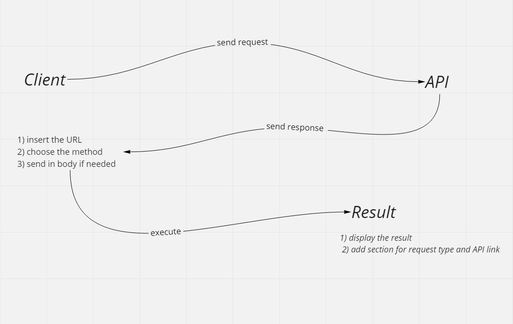

# resty

## description
created an application to send requests to third API to get the data from

## UML

## Link
[pull request](https://github.com/islam-Attar/resty/pull/4/)
[Netlify deploy](https://627fd724f1045a0c79fc8718--jazzy-alfajores-7f21e4.netlify.app/)
